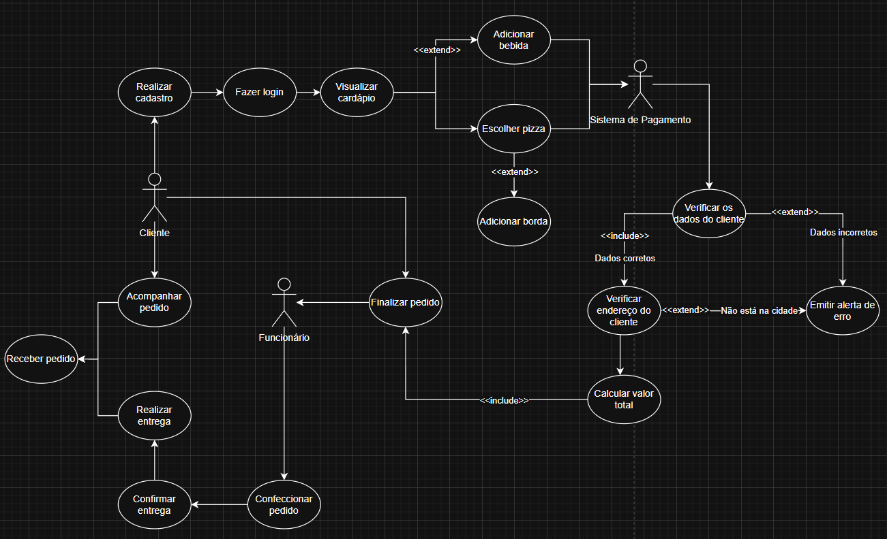

## 🍕 Pizzaria Paraíso 

_Descrição do Projeto:_

> A Pizzaria Paraíso é um comércio fictício que enfrenta alguns problemas para vender seus produtos, como a falta de um sistema de entregas. Na disciplina de Projeto Integrador, criaremos um site para essa empresa visando aumento dos lucros e consolidação de novos clientes.

---

_Professor_: [Marco André Mendes](github.com/marcoandre)

##  Equipe

<table align="center">
  <tr>
    <td align="center">
       
      <b>Ester dos Santos Antunes</b>
    </td>
    <td align="center">
       
      <b>Juliane Blasius</b>
    </td>
    <td align="center">
       
      <b>Renata Da Silva De Lima</b>
    </td>
  </tr>
</table>

## ⚒️ Projetos

📚 [Documentação](https://github.com/projeto-Integrador-Pizzaria/Documentacao.git )

 [Front-End](https://github.com/projeto-Integrador-Pizzaria/Frontend.git)

 [Back-End](https://github.com/projeto-Integrador-Pizzaria/Backend.git)

## Situação Problema:
  A pizzaria está situada em um local inadequado para o atendimento presencial, pois possui um pequeno espaço, além de estar localizada em um bairro afastado e violento, o que faz com que os clientes deixem de comprar. Outro ponto importante é a comodidade, uma vez que, nos tempos atuais, os consumidores não desejam sair de casa para comprar uma pizza, ou mesmo fazer o pedido no estabelecimento e lá aguardar até que fique pronto. Ademais, a inauguração do comércio é recente, portanto poucas pessoas o conhecem. Portanto, a loja precisa de um sistema de entregas e de um site chamativo para atrair novos clientes.

## Descrição da Proposta:
  Criaremos um site para divulgar a pizzaria, utilizaremos um cardápio atrativo, em que o cliente terá a possibilidade de pesquisar os sabores desejados, otimizando o seu tempo. Na etapa do pedido, será possível adicionar itens avulsos da bomboniere, como doces e bebidas, oferecendo uma experiência completa. Para valorizar o consumidor, haverá um programa de fidelidade, registrando cada pedido feito, de modo que, quando chegar em 10, ele ganhará uma pizza média grátis. Desenvolveremos um sistema de entregas, em que o usuário poderá acompanhar seu pedido, verificando em qual estágio ele está (sendo preparado, saiu para a entrega e entregue).

## Modelagem de Dados

  

## Requisitos

> Criaremos um site para divulgar a pizzaria, utilizaremos um cardápio atrativo,
em que o cliente terá a possibilidade de pesquisar os sabores desejados,
otimizando o seu tempo. Na etapa do pedido, será possível adicionar itens
avulsos da bomboniere, como doces e bebidas, oferecendo uma experiência
completa. Para valorizar o consumidor, haverá um programa de fidelidade,
registrando cada pedido feito, de modo que, quando chegar em 10, ele
ganhará uma pizza média grátis. Desenvolveremos um sistema de entregas,
em que o usuário poderá acompanhar seu pedido, verificando em qual estágio
ele está (sendo preparado, saiu para a entrega e entregue).
---

#### RF001 - O sistema deve manter Usuário
   - **RN001:** Os dados de Usuário são: CPF, nome, ID do telefone, ID do endereço, ID do e-mail, senha e nome de usuário;
  - **RN002:** Usuário é uma generalização parcial;
  - **RN003:** Usuário deve se relacionar com Telefone;
  - **RN004:** Usuário deve se relacionar com Endereço;
  - **RN005:** Usuário deve se relacionar com E-mail;

#### RF002 - O sistema deve manter Cliente
  - **RN006:** Os dados de Cliente são: ID do cliente, ID do endereço, CPF do usuário e ID do telefone.
  - **RN007:** Cliente é uma especialização de Usuário.
  - **RN008:** Cliente pode realizar vários ou nenhum pedido.

#### RF003 - O sistema deve manter Funcionário
  - **RN009:** Os dados de Funcionário são: CPF, ID do funcionário, cargo e remuneração.
  - **RN010:** Funcionário é uma especialização de Usuário.

#### RF004 - O sistema deve manter Endereço
  - **RN011:** Os dados de Endereço são: ID, número da residência, moradia, rua, bairro, cidade, complemento.

#### RF005 - O sistema deve manter Telefone
  - **RN012:** Os dados de Telefone são: ID, DDD, número de telefone.

#### RF006 - O sistema deve manter E-mail
  - **RN013:** Os dados de E-mail são: ID e e-mail do usuário.

#### RF007 - O sistema deve manter Pizza
  - **RN014:** Os dados de Pizza são: ID, ID do tamanho, ID do sabor e ID da borda.
  - **RN015:** Pizza deve se relacionar com Sabor.
  - **RN016:** Pizza deve se relacionar com Tamanho.
  - **RN017:** Pizza deve se relacionar com Borda.

#### RF008 - O sistema deve manter Sabor
  - **RN018:** Os dados de Sabor são: ID, nome, descrição e preço.
  - **RN019:** Sabor se relaciona com Borda.
  - **RN020:** Sabor se relaciona com Tamanho.
  - **RN021:** Cada Sabor possui preço.

#### RF009 - O sistema deve manter Borda
  - **RN022:** Os dados de Borda são: ID, nome, descrição e preço.
  - **RN023:** Borda se relaciona com Tamanho.
  - **RN024:** Cada Borda possui preço.

#### RF010 - O sistema deve manter Tamanho
  - **RN025:** Os dados de Tamanho são: ID, nome, diâmetro e preço.
  - **RN026:** Cada Tamanho possui preço.

#### RF011 - O sistema deve manter Bebida
  - **RN027:** Os dados de Bebida são: ID, nome, volume, preço e descrição.
  - **RN028:** Cada Bebida possui preço.

#### RF012 - O sistema deve manter Doce
  - **RN029:** Os dados de Doce são: ID, nome, preço e descrição.
  - **RN030:** Cada Doce possui preço.

#### RF013 - O sistema deve manter Pedido
  - **RN031:** Os dados de Pedido são: ID, ID da Bebida, ID do Doce, ID da pizza e ID do cliente.
  - **RN032:** O preço final do pedido deve ter como base o tamanho da pizza, os sabores e a borda escolhida, além, se houver, da bebida e do doce.
  - **RN033:** Pedido só existe se Cliente existir.

#### RF014 - O sistema deve manter controle de Pedidos do Cliente
  - **RN034:** Quando um Cliente fizer 10 pedidos, ele ganha uma pizza média grátis.

#### RF015 - O sistema deve manter Status do Pedido
  - **RN035:** Os dados de Status do Pedido são: ID, ID do Pedido e situação do pedido.

#### Requisitos Não Funcionais (RNF)

  - **RNF001:** O sistema deve ser responsivo.
  - **RNF002:** O sistema deve ser desenvolvido em Vue.js.
  - **RNF003:** O backend do sistema deve ser desenvolvido em Django.

---

## Casos de Uso

**1º** - *O principal produto de vendas da Pizzaria Paraíso são as pizzas e, como acontece
naturalmente, o cliente tem a possibilidade de solicitar a produção da pizza, selecionando
as especificações básicas, como tamanho, recheios e borda; a empresa faz os custos da
confecção e entrega ao cliente o valor final. A principal função desenvolvida para o site foi
justamente uma página que simula esse processo de orçamento do pedido, em que, ao
final, o sistema indica o preço total de fabricação. Um dos requisitos formulados é de que o
usuário possui a viabilidade de customizar a pizza, podendo colocar recheios nas bordas,
escolher o sabor que deseja e adicionar itens a mais, como bebidas e doces.
Sobre o cômputo, ele consiste numa série de procedimentos criados pela equipe e que se
aproxima ao máximo dos cálculos reais da pizzaria. Por se tratar de situações muito
intuitivas, a criação de uma fórmula teria o papel de auxiliar a transcrição desse processo
para o código, sendo as mesmas variáveis participantes da fórmula aquelas definidas no
Vue.js. Além disso, as operações foram escritas basicamente para o JavaScript.
**2º** Ao realizar o processo de customização do pedido, antes do sistema informar o preço
final, ele efetua a verificação dos dados, analisando se todos os campos obrigatórios estão
selecionados. Caso a verificação indique que falta algo, o sistema avisa o usuário por meio
de um campo de alerta.
**3º** Ao realizar o procedimento de solicitar a entrega, antes do sistema confirmar o pedido,
ele efetua a verificação dos dados, analisando se: **a)** todos os campos obrigatórios foram
preenchidos; **b)** se o endereço indicado está na mesma cidade que a pizzaria se localiza.
Caso a verificação indique que algo não está correto, o sistema avisa o usuário por meio de
um campo de alerta.*

## Diagrama de Caso de Uso

  

